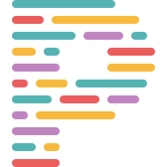

<h1 align="center">
   
🎮 Lets Play
</h1>

Full stack web application using Typescript with React for the frontend and a Koa backend  and <b>full testing and deployment automation</b> (GitHub Actions, Docker). 

&nbsp;&nbsp;&nbsp;&nbsp;&nbsp;&nbsp;&nbsp;&nbsp;&nbsp;

## 🕹️ Visit the [latest](http://letsplaytech.com) version of the site!

We hope you enjoy!

## Contributors
<table>
  <tbody>
    <tr>
      <td align="center">
        
         <strong>Shawn Long</strong> 
        
        
      </td>
      <td align="center">
        
         <strong>Alberto Gonzalez-Trujillo</strong> 
        
      </td>
    </tr>
  </tbody>
</table>

## Our Tools

<table>
  <tr>
    <td align="center">
      
    </td>
    <td>
      <table>
        <tr>
          <td>
            <strong>React</strong>
          </td>
        </tr>
        <tr>
          <td width=600px>Our favorite UI library (this week)
          </td>
        </tr>
      </table>
    </td>
  </tr>
</table>
<table style="width: 100%">
  <tr>
    <td align="center">
      
    </td>
    <td>
      <table>
        <tr>
          <td>
            <strong>Create React App</strong>
          </td>
        </tr>
        <tr>
          <td width=600px>Quick and easy bootstrapping
          </td>
        </tr>
      </table>
    </td>
  </tr>
</table>
<table style="width: 100%">
  <tr>
    <td align="center">
      
    </td>
    <td>
      <table>
        <tr>
          <td>
            <strong>Typescript</strong>
          </td>
        </tr>
        <tr>
          <td width=600px>We like our javascript types brewed <strong>strong</strong>
          </td>
        </tr>
      </table>
    </td>
  </tr>
</table>
<table style="width: 100%">
  <tr>
    <td align="center">
      
    </td>
    <td>
      <table>
        <tr>
          <td>
            <strong>Sass</strong>
          </td>
        </tr>
        <tr>
          <td width=600px>Styling with superpowers
          </td>
        </tr>
      </table>
    </td>
  </tr>
</table>
<table style="width: 100%">
  <tr>
    <td align="center">
      
    </td>
    <td>
      <table>
        <tr>
          <td>
            <strong>Node.js</strong>
          </td>
        </tr>
        <tr>
          <td width=600px>The classic javascript runtime
          </td>
        </tr>
      </table>
    </td>
  </tr>
</table>
<table style="width: 100%">
  <tr>
    <td align="center">
      
    </td>
    <td>
      <table>
        <tr>
          <td>
            <strong>Jest</strong>
          </td>
        </tr>
        <tr>
          <td width=600px>Because testing is no laughing matter
          </td>
        </tr>
      </table>
    </td>
  </tr>
</table>
<table style="width: 100%">
  <tr>
    <td align="center">
      
    </td>
    <td>
      <table>
        <tr>
          <td>
            <strong>Koa</strong>
          </td>
        </tr>
        <tr>
          <td width=600px>Keeps our backend well rooted
          </td>
        </tr>
      </table>
    </td>
  </tr>
</table>
<table style="width: 100%">
  <tr>
    <td align="center">
      
    </td>
    <td>
      <table>
        <tr>
          <td>
            <strong>Mirage JS</strong>
          </td>
        </tr>
        <tr>
          <td width=600px>A make-believe backend (because the real world is scary)
          </td>
        </tr>
      </table>
    </td>
  </tr>
</table>
<table style="width: 100%">
  <tr>
    <td align="center">
      
    </td>
    <td>
      <table>
        <tr>
          <td>
            <strong>GitHub</strong>
          </td>
        </tr>
        <tr>
          <td width=600px>CI/CD, source control, container registry, might as well own our project
          </td>
        </tr>
      </table>
    </td>
  </tr>
</table>
<table style="width: 100%">
  <tr>
    <td align="center">
      
    </td>
    <td>
      <table>
        <tr>
          <td>
            <strong>Docker</strong>
          </td>
        </tr>
        <tr>
          <td width=600px>Keeps our app swimming
          </td>
        </tr>
      </table>
    </td>
  </tr>
</table>
<table style="width: 100%">
  <tr>
    <td align="center">
      
    </td>
    <td>
      <table>
        <tr>
          <td>
            <strong>ESLint</strong>
          </td>
        </tr>
        <tr>
          <td width=600px>Great style isn't optional
          </td>
        </tr>
      </table>
    </td>
  </tr>
</table>
<table style="width: 100%">
  <tr>
    <td align="center">
      
    </td>
    <td>
      <table>
        <tr>
          <td>
            <strong>Prettier</strong>
          </td>
        </tr>
        <tr>
          <td width=600px>Like a roomba but for our code
          </td>
        </tr>
      </table>
    </td>
  </tr>
</table>
<table style="width: 100%">
  <tr>
    <td align="center">
      
    </td>
    <td>
      <table>
        <tr>
          <td>
            <strong>Google TypeScript Style</strong>
          </td>
        </tr>
        <tr>
          <td width=600px>If you can't beat 'em, join 'em
          </td>
        </tr>
      </table>
    </td>
  </tr>
</table>
<table style="width: 100%">
  <tr>
    <td align="center">
      
    </td>
    <td>
      <table>
        <tr>
          <td>
            <strong>Digital Ocean</strong>
          </td>
        </tr>
        <tr>
          <td width=600px>Where else would our containers swim?
          </td>
        </tr>
      </table>
    </td>
  </tr>
</table>

